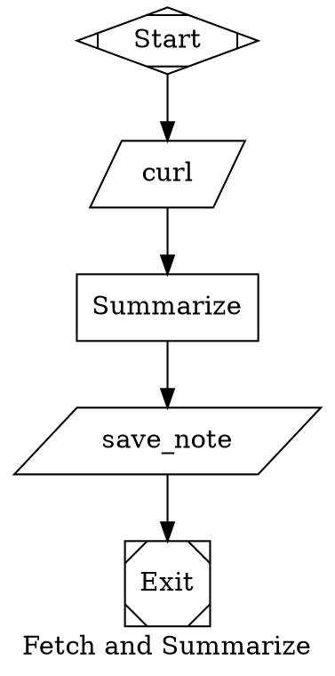

# Step Flow Notation (SFN)

A concise text format for describing multi-step AI workflows. Write a pipeline on your phone in a few lines of text, then convert it to a machine-executable graph.

## What problem does this solve?

### AI agents need orchestration

Modern AI coding agents — Claude Code, OpenAI Codex, Gemini CLI — are powerful, but they execute one task at a time. Real-world work often requires chaining multiple steps together: fetch data, analyze it, branch on a condition, loop until tests pass, get human approval, save the result.

This is **agent orchestration** — defining a multi-step pipeline where each step can be an LLM call, a tool/CLI command, or a human decision point, with conditional branching and loops connecting them.

Projects like [StrongDM’s Attractor](https://github.com/strongdm/attractor) have shown that defining these pipelines as directed graphs (using Graphviz DOT syntax) is a clean, powerful approach. The graph is the workflow: nodes are tasks, edges are transitions, and attributes configure behavior.

### DOT is powerful but painful to write by hand

Here’s a simple three-step pipeline in DOT — fetch a page, summarize it, save the result:



That’s a lot of boilerplate for three steps. Now imagine writing this on a phone, or adding branching and loops. It gets unwieldy fast.

This matters because mobile-first development is becoming real. Tools like [OpenClaw](https://openclaw.ai/) let you run autonomous coding agent loops from your phone via Telegram or WhatsApp. ChatGPT and Claude mobile apps keep adding coding features. People are increasingly defining and triggering work from their phones — but DOT syntax was never designed for a touchscreen keyboard.

### SFN: the same pipeline in three lines

```
1. tool:curl -s https://example.com => page
2. llm "summarize {page}" => summary
3. tool:save_note --text={summary}
```

That’s it. Same pipeline, same semantics. An LLM or a converter tool translates this into a full DOT graph with all the plumbing — file passing, prompt contracts, node shapes, edge routing — handled automatically.

## How it works

An SFN flow is a numbered list of steps. Each step has a type (`tool`, `llm`, or `wait_human`), optional arguments, and optional modifiers in parentheses:

```
N. type[:param] [args...] ["prompt"] ([after X,Y][, if condition][, goto N][, => name])
```

Steps run sequentially by default. You only need parentheses when you want to override that — to declare dependencies, add conditions, create loops, or name outputs.

### A practical example

Here’s a flow that fetches a web page, checks if it mentions a specific domain, and takes different actions based on the result:

```
1. tool:curl -s https://example.com/links => page
2. llm "analyze {page}, is it relevant to our project?" => review
3. wait_human => decision
4. tool:save_db --payload={review} (after 3, if contains("approved"))
5. llm "draft rejection reason" (after 3, if contains("rejected"))
```

What’s happening here:

- Steps 1-3 run sequentially (no `after` needed — it’s implied).
- Step 1 names its output `page`, which step 2 references as `{page}`.
- Step 3 pauses for human input. The person’s response becomes the output.
- Steps 4 and 5 both depend on step 3 but with different conditions — they branch based on what the human said. Only one of them runs.

### Parallel execution and convergence

Steps can run in parallel and converge:

```
1. tool:curl -s https://site-a.com => a
2. tool:curl -s https://site-b.com (after 0) => b
3. llm "compare {a} vs {b}" (after 1, 2)
```

Step 2 uses `after 0` (the implied start step) to run in parallel with step 1. Step 3 waits for both to finish before running.

### Loops

Use `goto` with a condition to create loops:

```
1. llm "implement the next feature"
2. tool:run_tests => tests
3. llm "fix failing tests" (after 2, if failed, goto 2)
```

Step 3 only runs if tests fail, fixes the code, then jumps back to step 2 to re-run tests. When tests pass, the flow continues forward.

## Repository contents

|File                        |Description                                                             |
|----------------------------|------------------------------------------------------------------------|
|`step-flow-notation.md`     |The SFN specification — syntax, semantics, and examples                 |
|`skills/sfn-to-dot/SKILL.md`|Converter skill for translating SFN into Attractor-compatible DOT graphs|

### Using the SFN specification

The spec (`step-flow-notation.md`) is a reference document. You can include it in your LLM’s context to let it understand and generate SFN flows, or use it as a guide when writing flows yourself.

### Using the converter skill

The skill file (`skills/sfn-to-dot/SKILL.md`) is designed for LLM-based coding tools that support skill files — such as [OpenClaw](https://openclaw.ai/) (via ClawHub), [Kilroy](https://github.com/danshapiro/kilroy), or any tool that can load a SKILL.md into its context. Drop it into your skills directory and the LLM will know how to convert SFN flows into valid DOT pipeline graphs, handling all the plumbing: node shapes, file-based data passing, prompt contracts for extractive LLM steps, and failure routing.

You can also paste the skill content directly into a conversation with any LLM and ask it to convert an SFN flow.

## Quick reference

|Concept               |Syntax       |Example                        |
|----------------------|-------------|-------------------------------|
|Sequential step       |`N. type ...`|`2. llm "summarize {page}"`    |
|Named output          |`=> name`    |`1. tool:curl url => page`     |
|Dependency            |`after X`    |`(after 3)`                    |
|Parallel start        |`after 0`    |`(after 0)`                    |
|Convergence (AND-join)|`after X, Y` |`(after 1, 2)`                 |
|Condition             |`if ...`     |`(after 2, if contains("yes"))`|
|Loop                  |`goto N`     |`(after 3, if failed, goto 2)` |
|Human gate            |`wait_human` |`3. wait_human => decision`    |

## License

Apache 2.0