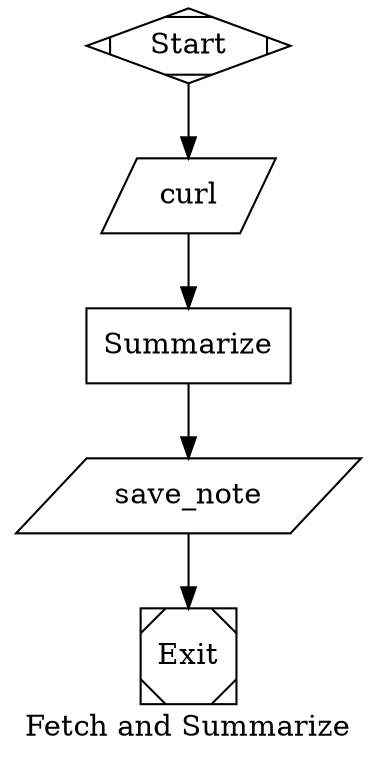

# Step Flow Notation (SFN)

A short text format for multi-step AI workflows. Write a pipeline in a few lines — even on a phone — then convert it to a machine-executable graph.

## What problem does this solve?

### AI agents need orchestration

Coding agents such as Claude Code, OpenAI Codex, and Gemini CLI are strong at single tasks. Real work usually needs a chain: fetch data, analyze it, branch on a result, loop until tests pass, ask a human, then save the outcome.

That chain is **agent orchestration** — a multi-step pipeline of LLM calls, tools/CLI commands, and human gates, linked by conditions and loops.

Projects like [StrongDM’s Attractor](https://github.com/strongdm/attractor) treat these pipelines as directed graphs (Graphviz DOT). Nodes are tasks, edges are transitions, and attributes configure behavior.

### DOT is powerful but hard to write by hand

A simple three-step pipeline in DOT — fetch a page, summarize it, save the result:


```dot
digraph pipeline {
    graph [label="Fetch and Summarize"]
    node [shape=box]

    start     [shape=Mdiamond, label="Start"]
    exit      [shape=Msquare, label="Exit"]

    fetch     [shape=parallelogram, label="curl",
               tool_command="curl -s https://example.com > /tmp/attractor_page.txt"]
    summarize [label="Summarize",
               prompt="Read the content from /tmp/attractor_page.txt and summarize it.
                       If successful, write ONLY the summary to /tmp/attractor_summary.txt
                       and respond with a single line: SUCCESS.
                       If you cannot complete the task, respond with a single line:
                       ERROR: <brief reason>."]
    save      [shape=parallelogram, label="save_note",
               tool_command="save_note --text=$(cat /tmp/attractor_summary.txt)"]

    start     -> fetch
    fetch     -> summarize
    summarize -> save
    save      -> exit
}
```

That is a lot of boilerplate for three steps. Branching and loops make it worse. On a phone keyboard it is nearly unusable.

Mobile-first agent work is already here. Tools like [OpenClaw](https://openclaw.ai/) run coding loops from Telegram or WhatsApp. ChatGPT and Claude mobile apps keep adding coding features. People start work from phones — but DOT was never meant for a touchscreen.

### SFN: the same pipeline in three lines

```
1. tool:curl -s https://example.com => page
2. llm "summarize {page}" => summary
3. tool:save_note --text={summary}
```

Same pipeline, same semantics. An LLM or converter expands this into a full DOT graph — file passing, prompt contracts, node shapes, and edge routing included.

## How it works

An SFN flow is a numbered list of steps. Each step has a type (`tool`, `llm`, or `wait_human`), optional arguments, and optional modifiers:

```
N. type[:param[:subparam]] [args...] ["prompt"] ([after X,Y][, if condition][, goto N]) [=> name]
```

Steps run in order by default. Use parentheses only for dependencies, conditions, or loops. Bind outputs with `=>` after the step.

### Why not describe workflows in English?

You can skip an intermediate notation and ask an LLM to turn plain English into DOT. Kilroy's [english-to-dotfile](https://github.com/danshapiro/kilroy/blob/c242e4f03b777ff38c3f3e20a09b91abac83f59e/skills/english-to-dotfile/SKILL.md) skill does that. It works — but one generation must invent node count, step granularity, edges, conditions, data wiring, prompt contracts, and failure handling. Those choices are assumptions the user never stated. Small wording changes often produce different graphs.

That is the [hidden dependency problem](https://micro.50lo.me/2026/02/28/prompts-have-dependencies-too.html): every prompt carries invisible assumptions. When the LLM owns all structural decisions, the assumption surface is large.

SFN sits between natural language and DOT. You state the structure — steps, links, conditions — and the converter handles mechanical DOT details: shapes, file plumbing, prompt contracts, failure routing. The notation limits what the LLM can invent. You keep architectural control; the LLM formats.

### A practical example

Fetch a pull request, review it, then branch on a human decision:

```
1. tool:curl -s https://api.github.com/repos/50lo/SFN/pulls/1 => pr
2. llm "review {pr}: is this ready to merge?" => review
3. wait_human => decision
4. tool:save_db --payload={review} (after 3, if contains("approved"))
5. llm "draft a clear rejection note for the author" (after 3, if contains("rejected"))
```

What happens:

- Steps 1–3 run in sequence (`after` is implied).
- Step 1 names its output `pr`; step 2 uses `{pr}`.
- Step 3 waits for a human reply; that reply is the output.
- Steps 4 and 5 both depend on step 3 with different conditions. Only one runs.

### Parallel execution and convergence

Steps can run in parallel, then join:

```
1. tool:curl -s https://docs.example.com/v1/auth => v1
2. tool:curl -s https://docs.example.com/v2/auth (after 0) => v2
3. llm "compare auth docs {v1} vs {v2}; list breaking changes" (after 1, 2)
```

Step 2 uses `after 0` (implied start) so it runs beside step 1. Step 3 waits for both.

### Loops

Use `goto` with a condition:

```
1. llm "implement the next feature"
2. tool:run_tests => tests
3. llm "fix failing tests" (after 2, if failed, goto 2)
```

Step 3 runs only when tests fail, fixes the code, then returns to step 2. When tests pass, the flow continues forward.

## Repository contents

|File                        |Description                                                             |
|----------------------------|------------------------------------------------------------------------|
|`step-flow-notation.md`     |SFN specification — syntax, semantics, and examples                     |
|`skills/sfn-to-dot/SKILL.md`|Converter skill: SFN → Attractor-compatible DOT graphs                  |
|`skills/sfn-to-python/`     |Converter skill: SFN → Python scripts that call coding-agent CLIs       |
|`skills/sfn-to-acp/`        |Converter skill: SFN → Python scripts that call agents over ACP         |

### Using the SFN specification

Treat `step-flow-notation.md` as a reference. Put it in an LLM's context so the model can read and write SFN, or use it yourself while authoring flows.

### Using the converter skills

`skills/sfn-to-dot/SKILL.md` targets LLM coding tools that load skill files — [OpenClaw](https://openclaw.ai/) (via ClawHub), [Kilroy](https://github.com/danshapiro/kilroy), or any tool that can load a SKILL.md. Drop it into your skills directory and the model can turn SFN into valid DOT pipelines, including node shapes, file-based data passing, extractive prompt contracts, and failure routing.

You can also paste the skill into any LLM chat and ask it to convert a flow.

The Python-oriented skills follow the same pattern:

- `skills/sfn-to-python/SKILL.md` emits standalone Python that invokes coding-agent CLIs.
- `skills/sfn-to-acp/SKILL.md` emits standalone Python with the same SFN surface, routing `llm` steps through the Agent Client Protocol (ACP).

## Quick reference

|Concept               |Syntax                  |Example                        |
|----------------------|------------------------|-------------------------------|
|Sequential step       |`N. type ...`           |`2. llm "summarize {page}"`    |
|LLM selector          |`llm[:agent[:model]]`   |`2. llm:codex:gpt-5.4 "..."`   |
|Named output          |`=> name`               |`1. tool:curl url => page`     |
|Dependency            |`after X`               |`(after 3)`                    |
|Parallel start        |`after 0`               |`(after 0)`                    |
|Convergence (AND-join)|`after X, Y`            |`(after 1, 2)`                 |
|Condition             |`if ...`                |`(after 2, if contains("yes"))`|
|Loop                  |`goto N`                |`(after 3, if failed, goto 2)` |
|Human gate            |`wait_human`            |`3. wait_human => decision`    |

## License

Apache 2.0
