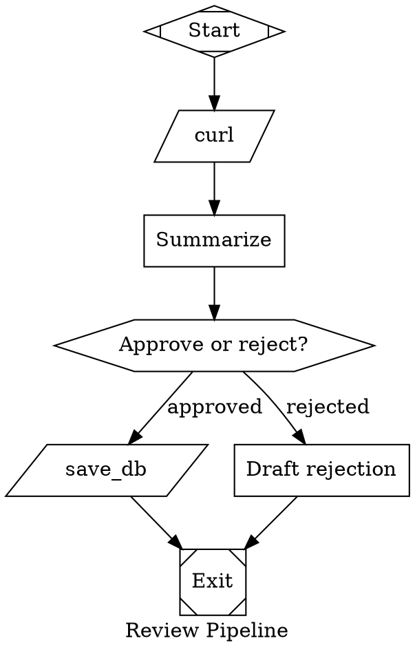

# SFN to DOT

Convert Step Flow Notation into Attractor DOT pipeline digraphs.

## Step Flow Notation (input format)

SFN is a concise text format for multi-step workflows.

### Step syntax

```
N. type[:param] [args...] ["prompt"] ([after X[,Y...]][, if cond][, goto N][, => name])
```

| Part | Meaning |
|------|---------|
| `N` | Step number (1-based) |
| `type` | `tool`, `llm`, or `wait_human` |
| `:param` | Tool name for `tool` type (e.g. `tool:fetch_url`) |
| `args` | Shell-style arguments (see below) |
| `"prompt"` | Inline instruction for `llm` steps |
| `after X,Y` | Dependencies. Omitted = depends on N-1. `after 0` = depends on flow start |
| `if cond` | Conditional gate on parent output |
| `goto N` | Loop back to step N after completion |
| `=> name` | Name this step's output for `{name}` interpolation in later steps |

### Tool argument syntax

Tool args use shell-passthrough style — the args after `tool:name` are passed verbatim as a shell command, so write them exactly as you would at a terminal:

| Form | Meaning | Example |
|------|---------|---------|
| `-f` | Boolean flag (no value) | `tool:curl -s` |
| `--flag` | Boolean flag, long form | `tool:curl --silent` |
| `-f value` | Flag with value | `tool:jq -r '.name'` |
| `--flag=value` | Flag with value, long form | `tool:curl --output=file.html` |
| `bareword` | Positional argument | `tool:echo hello` |
| `{var}` | Interpolated variable (positional or as a value) | `tool:curl -s {page_url}` |

Multiple args are space-separated as in a shell. Quote values that contain spaces: `tool:echo "hello world"`.

### Defaults

- Step N implicitly depends on step N-1 when `after` is omitted.
- Step 1 implicitly depends on step 0 (flow start).
- Steps with no dependents are end nodes.
- `wait_human` pauses until user responds; response becomes step output.

### Conditions

Evaluated against the triggering parent's output:

- Status: `succeeded`, `failed`
- Text: `contains("text")`, `match(/regex/)`
- Structured: `has(key)`, `eq(key,"value")`
- Boolean: `and`, `or`, `not`

### Patterns

- **Parallel**: two steps with same `after`, no `if` → run concurrently.
- **Branch**: same `after`, different `if` conditions → conditional routing.
- **Converge**: one step with `after X, Y` → waits for multiple parents.
- **Loop**: `goto N` (with optional `if`) → cycle back.
- **Default branch**: among conditional siblings, a step without `if` acts as else.

### SFN example

```
1. tool:curl -s https://example.com => page
2. llm "summarize {page}" => summary
3. wait_human => decision
4. tool:save_db --payload={summary} (after 3, if contains("approved"))
5. llm "draft rejection reason" (after 3, if contains("rejected"))
```

Note: the `{page}` and `{summary}` references look simple to the SFN author. The converter handles the file-based plumbing automatically when generating DOT (see *Passing data between steps*).

## DOT Pipeline (output format)

Output is an Attractor DOT digraph — a strict subset of Graphviz DOT.

### Structure

```dot
digraph PipelineName {
    // Graph attributes
    graph [goal="...", label="..."]

    // Node defaults (optional)
    node [shape=box]

    // Start and exit (required)
    start [shape=Mdiamond, label="Start"]
    exit  [shape=Msquare, label="Exit"]

    // Nodes
    node_id [shape=..., label="...", prompt="..."]

    // Edges
    start -> step1
    step1 -> step2 [label="...", condition="..."]
}
```

### Shape mapping (SFN type → DOT shape)

| SFN type | DOT shape | Handler |
|----------|-----------|---------|
| `llm` | `box` (default) | LLM task |
| `tool:name` | `parallelogram` | Tool execution |
| `wait_human` | `hexagon` | Human gate |
| _(start)_ | `Mdiamond` | Entry point |
| _(exit)_ | `Msquare` | Exit point |

### Node attributes

| Key | Type | Use |
|-----|------|-----|
| `label` | String | Display name |
| `shape` | String | Handler type (see mapping above) |
| `prompt` | String | LLM instruction. Supports `$variable` expansion |
| `tool_command` | String | Shell command for tool nodes |
| `timeout` | Duration | e.g. `"900s"`, `"15m"` |

### Edge attributes

| Key | Type | Use |
|-----|------|-----|
| `label` | String | Display caption / routing key |
| `condition` | String | Boolean guard expression |

### Condition syntax in DOT

```
outcome=success | outcome=fail | outcome=partial_success
tool.output contains "text"
last_response contains "text"
human.gate.selected=A
key=value | key!=value | !key=value
clause1 && clause2 | clause1 || clause2
```

### Validation requirements

- Exactly one `Mdiamond` (start) and one `Msquare` (exit) node.
- All nodes reachable from start.
- Start has no incoming edges; exit has no outgoing edges.
- Edge targets must reference existing nodes.

## Passing data between steps

The Attractor engine does **not** interpolate context variables into `tool_command`. A tool node cannot read `$last_response` or any other context key — those are engine-internal and not shell environment variables. This means `{var}` references in SFN tool args cannot be converted to `$var` in DOT.

**Use temporary files to pass data between steps.** When converting SFN, the converter must automatically wire up file-based data passing wherever a downstream step references an upstream output with `{name}`. The SFN user does not need to know about this — the converter handles it transparently.

File path convention: `/tmp/attractor_<name>.txt` where `<name>` is the SFN output name.

### How to wire each producer → consumer pattern

| Producer | How to write | Example |
|----------|-------------|---------|
| `tool:` | Redirect stdout to file: append `> /tmp/attractor_<name>.txt` to `tool_command` | `tool_command="curl -s https://example.com > /tmp/attractor_page.txt"` |
| `llm` | Append to prompt: *"If successful, write ONLY the raw result to /tmp/attractor_\<name\>.txt and respond with a single line: SUCCESS. If you cannot complete the task, respond with a single line: ERROR: \<brief reason\>."* | `prompt="Find the URL to page 2. If successful, write ONLY the raw URL to /tmp/attractor_page2_url.txt and respond with a single line: SUCCESS. If you cannot complete the task, respond with a single line: ERROR: <brief reason>."` |

| Consumer | How to read | Example |
|----------|------------|---------|
| `tool:` | Use `$(cat /tmp/attractor_<name>.txt)` in `tool_command` | `tool_command="curl -s $(cat /tmp/attractor_page2_url.txt)"` |
| `llm` | Append to prompt: *"Read the content from /tmp/attractor_\<name\>.txt"* | `prompt="Summarize the content from /tmp/attractor_page.txt"` |

### When file passing is NOT needed

- **tool → llm** (no `{var}` reference in prompt): the LLM receives the full pipeline context including `tool.output` automatically. Only use file passing if the tool output is very large and would be truncated by the engine.
- **llm → llm**: the LLM receives `last_response` in context automatically. Only use file passing if the SFN explicitly names the output with `=> name` and a non-adjacent LLM step references it.

## LLM failure handling

### The three failure modes

**Mode A — API failure** (`outcome=fail`): the backend throws an exception — auth error, network timeout, context overflow. The engine sets `outcome=fail`. Route with `condition="outcome=fail"`.

**Mode B — Semantic failure**: the API call succeeded but the LLM said "I couldn't find it." The engine sets `outcome=success` regardless. Route with `condition="last_response contains \"ERROR:\""` using the SUCCESS/ERROR prompt contract below.

**Mode C — Content routing**: route on what the LLM *said*, regardless of success or failure. Use `condition="last_response contains \"keyword\""`. Independent of modes A and B.

`last_response` holds the **first 200 characters** of the LLM text output. Ensure routing keywords appear in the first sentence of the response.

> **API failure leaves `last_response` stale.** When the backend fails (mode A), it does not update `last_response` — the value from the *previous* LLM step persists. A `last_response contains "ERROR:"` edge could accidentally fire on stale data if the previous step also output that keyword. Always pair `last_response contains` checks with `outcome=success` when there is any risk of stale data: `condition="outcome=success && last_response contains \"ERROR:\""`.

---

### Rule: success edge MUST be the no-condition default when SUCCESS/ERROR contract is active

`outcome=success` is true for **all** non-API-error LLM responses — including responses that begin with `ERROR:`. If the error edge uses `last_response contains "ERROR:"` and the success edge uses `condition="outcome=success"`, **both conditions fire simultaneously** when the LLM outputs `ERROR: ...`. The engine picks the first matching edge by order — correct by accident, wrong by design.

When the SUCCESS/ERROR contract is applied, the success path MUST have **no condition** (the default/else branch). The engine takes a no-condition edge only when no conditioned edges match.

```dot
// Correct — success is the no-condition default
llm_node -> llm_node_failed [label="error", condition="last_response contains \"ERROR:\""]
llm_node -> next_step                       // no condition — default/success branch

// WRONG — both conditions fire when response contains "ERROR:"
llm_node -> llm_node_failed [condition="last_response contains \"ERROR:\""]
llm_node -> next_step       [condition="outcome=success"]  // ← DO NOT do this
```

---

### When to apply the SUCCESS/ERROR contract

Apply when:
- The LLM step has `=> name` **and** its output is referenced by any downstream step, **or**
- The SFN has an explicit `if failed` branch on the LLM step

Do **not** apply to purely generative LLM steps (drafting, writing) with no `=> name` and no failure branch — the protocol boilerplate would clutter the response.

---

### Case 1: `=> name` with no explicit `if failed` — contract only, no auto-generated handler

Apply the SUCCESS/ERROR prompt contract to prevent bad data in the output file. Do **not** auto-generate a failure handler node — the user may intentionally not handle failure here, or may handle it downstream. If the LLM responds `ERROR:`, the default (no-condition) edge fires and the pipeline continues. Downstream tool steps that read the file will fail naturally (file not written or stale), producing a visible cascading error.

```dot
llm_node  [label="...", prompt="... If successful, write ONLY the result to
           /tmp/attractor_<name>.txt and respond with a single line: SUCCESS.
           If you cannot complete the task, respond with a single line: ERROR: <reason>."]

llm_node -> next_step    // no condition — fires on both SUCCESS and ERROR responses
```

---

### Case 2: explicit `if failed` on LLM step with `=> name` — two edges to same handler

The user's `if failed` signals intent to handle **all** LLM failures. Generate **two separate edges** to the failure handler — one per failure mode (two edges to the same target node are valid DOT; the engine picks the first matching one):

```dot
llm_node -> failure_handler [label="api error", condition="outcome=fail"]
llm_node -> failure_handler [label="error",     condition="last_response contains \"ERROR:\""]
llm_node -> success_step                        // no condition — default/success branch
```

List the two failure edges **before** the no-condition success edge. The engine evaluates conditioned edges first and takes the first match.

Apply the SUCCESS/ERROR prompt contract to the LLM node.

---

### Case 3: explicit `if failed` on LLM step WITHOUT `=> name` — single edge + warning

Without `=> name`, the LLM step is generative — do not apply the SUCCESS/ERROR contract. Generate a single `outcome=fail` edge but add a comment:

```dot
// NOTE: outcome=fail only catches API/network errors, not semantic failures.
// If this LLM step can fail to complete its task (e.g., content not found),
// give it a => name and use the SUCCESS/ERROR contract to also catch semantic failures.
llm_node -> failure_handler [label="failed",    condition="outcome=fail"]
llm_node -> success_step    [condition="outcome=success"]
```

Here `condition="outcome=success"` is safe: no `last_response contains` edge exists, so there is no conflict.

---

### Case 4: `if succeeded` with no `if failed` on an LLM step with `=> name`

Apply the SUCCESS/ERROR contract (Case 1). The `if succeeded` edge becomes the no-condition default. Do not use `condition="outcome=success"` — it would conflict with the error routing if `if failed` is added later. No auto-generated failure handler.

---

### Case 5: `if succeeded` + `if failed` on LLM step with `=> name`

Merge with Case 2. Both failure edges route to the user's `if failed` target. The user's `if succeeded` step becomes the no-condition default:

```dot
llm_node -> failure_handler [label="api error", condition="outcome=fail"]
llm_node -> failure_handler [label="error",     condition="last_response contains \"ERROR:\""]
llm_node -> success_step                        // user's "if succeeded" target — no condition
```

## Conversion rules

Apply these rules to translate SFN steps into DOT:

1. **Create start/exit nodes.** Every graph needs `start [shape=Mdiamond]` and `exit [shape=Msquare]`.

2. **Map steps to nodes.** For each SFN step N:
   - Generate a node ID from the step (e.g. `step_N`, or a descriptive id derived from the tool name, prompt, or output name).
   - Set `shape` per the type mapping.
   - For `llm`: set `prompt` from the quoted instruction. If this step has `=> name` and a downstream step references `{name}`, apply the SUCCESS/ERROR contract from *Passing data between steps* (write to file on success, respond `SUCCESS`; respond `ERROR: <reason>` on failure). If the SFN has an explicit `if failed` branch on this step, also generate failure edges as described in *LLM failure handling* (Case 2/5). If the prompt references `{name}` from an upstream step, append: *"Read the content from /tmp/attractor_\<name\>.txt"*.
   - For `tool:name`: set `label` to the tool name. Set `tool_command` to a raw shell command. If this step has `=> name` and a downstream step references `{name}`, redirect stdout to file: append `> /tmp/attractor_<name>.txt`. If the tool args contain `{var}`, replace with `$(cat /tmp/attractor_<var>.txt)`. Boolean flags (`-f`, `--flag`) are copied as-is.
   - For `wait_human`: set `label` to describe what the user is deciding.

3. **Map dependencies to edges.**
   - Step 1 with no explicit `after` → edge from `start`.
   - Step N with no `after` → edge from step N-1.
   - `after X, Y` → edges from step X and step Y to step N.
   - `after 0` → edge from `start`.

4. **Map conditions to edge attributes.** The correct translation depends on the **parent step type**:

   **`if succeeded`**
   - After `tool` → `condition="outcome=success"`
   - After `llm` without SUCCESS/ERROR contract → `condition="outcome=success"` (safe; no conflict)
   - After `llm` with SUCCESS/ERROR contract → **no condition** (default/else branch). Never `condition="outcome=success"` here — see *LLM failure handling*.
   - After `wait_human` → no condition needed; routing is label-based

   **`if failed`**
   - After `tool` → `condition="outcome=fail"`
   - After `llm` with `=> name` → two separate edges: `condition="outcome=fail"` AND `condition="last_response contains \"ERROR:\""` (apply SUCCESS/ERROR contract; list both before the success edge)
   - After `llm` without `=> name` → `condition="outcome=fail"` only, add comment warning that semantic failures are not caught
   - After `wait_human` → `condition="outcome=fail"` (fires on skip only, not on timeout — timeout produces `outcome=retry`)

   **`if contains("text")`**
   - After `tool` → `condition="outcome=success && tool.output contains \"text\""`. The `outcome=success` guard is required: on tool failure `tool.output` is empty, so a bare `contains` check would silently return false and the default branch would fire regardless of outcome.
   - After `llm` → `condition="last_response contains \"text\""`. Note: `last_response` is truncated to 200 chars — ensure the keyword appears early in the response. Also: `last_response` is stale on API failure; use `condition="outcome=success && last_response contains \"text\""` if there is any risk.
   - After `wait_human` → `condition="human.gate.label contains \"text\""` (matches the label of the choice the human selected, not freeform text)

   **Default/else branch among siblings with conditions**: the edge with **no condition** attribute fires when no conditioned sibling matches. This is the correct form for a success path when another sibling already handles failure.

   Adapt other SFN condition forms to DOT condition syntax using: `=`, `!=`, `contains`, `&&`.

5. **Map `goto N` to back-edges.** Create an edge from the current step's node back to step N's node. If combined with `if`, apply the condition to this back-edge.

6. **Connect end nodes to exit.** Steps with no outgoing dependents (no step depends on them, no `goto`) get an edge to `exit`.

7. **Handle parallel execution.** Two SFN steps with the same `after` and no conditions both run in parallel. In DOT, this is simply two edges from the same parent to different nodes (standard fan-out).

8. **Named outputs (`=> name`).** Use meaningful node IDs derived from the output name. When a downstream step references `{name}`, wire up file-based data passing as described in *Passing data between steps*. Scan all steps for `{name}` references to determine which outputs need files.

## When to ask the user

- SFN step has no prompt and no clear label → ask what the step does.
- Condition is ambiguous (could apply to multiple parent types) → ask which context key to use.
- Workflow has no clear end condition for a loop → confirm exit criteria.
- Tool args are incomplete or unclear → ask for details.
- User wants graph-level attributes (goal, model config, timeouts) → ask, or set sensible defaults and note them.

## Example conversion

### Input (SFN)

```
1. tool:curl -s https://example.com => page
2. llm "summarize {page}" => summary
3. wait_human => decision
4. tool:save_db --payload={summary} (after 3, if contains("approved"))
5. llm "draft rejection reason" (after 3, if contains("rejected"))
```

### Analysis

- Step 1 `=> page`: referenced by step 2 (`{page}`). Step 2 is `llm` → use file to pass large tool output. Redirect stdout to `/tmp/attractor_page.txt`.
- Step 2 `=> summary`: referenced by step 4 (`{summary}`). Step 4 is `tool` → apply the SUCCESS/ERROR contract: LLM writes result to `/tmp/attractor_summary.txt` on success, and always outputs `SUCCESS` or `ERROR: <reason>` as its text response. No `if failed` in SFN, so no failure handler is generated (Case 1).
- Step 2 also reads `{page}` → append "Read content from `/tmp/attractor_page.txt`" to prompt.
- Step 4 reads `{summary}` → use `$(cat /tmp/attractor_summary.txt)` in tool_command.

### Output (DOT)



## Output guidelines

- Use descriptive node IDs (lowercase_snake_case), not generic `step_1`, `step_2`.
- Always include `start` and `exit` nodes.
- Set `node [shape=box]` as default so LLM nodes don't need explicit shape.
- Add `graph [label="..."]` with a descriptive pipeline name.
- Add `graph [goal="..."]` if the user provides a clear goal.
- Include comments for clarity when the graph is complex.
- Produce valid DOT that passes Attractor validation rules.
